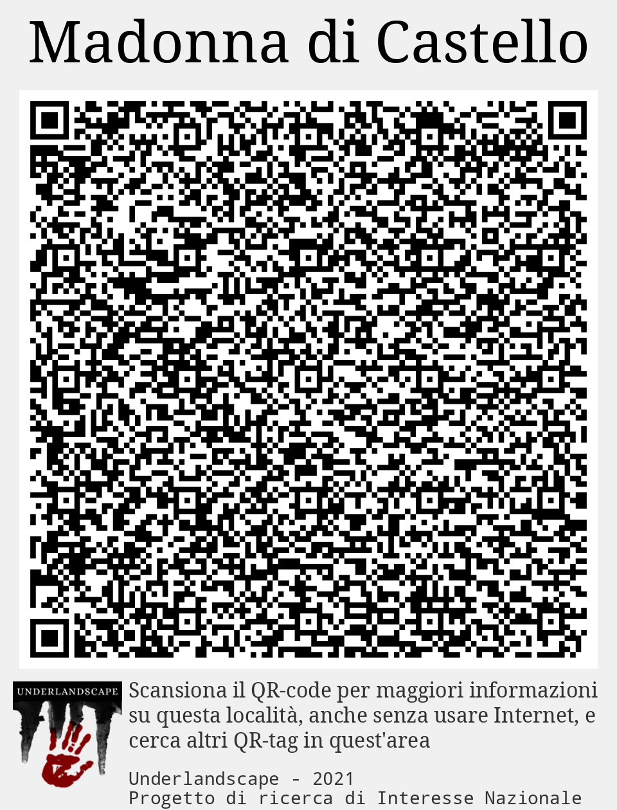
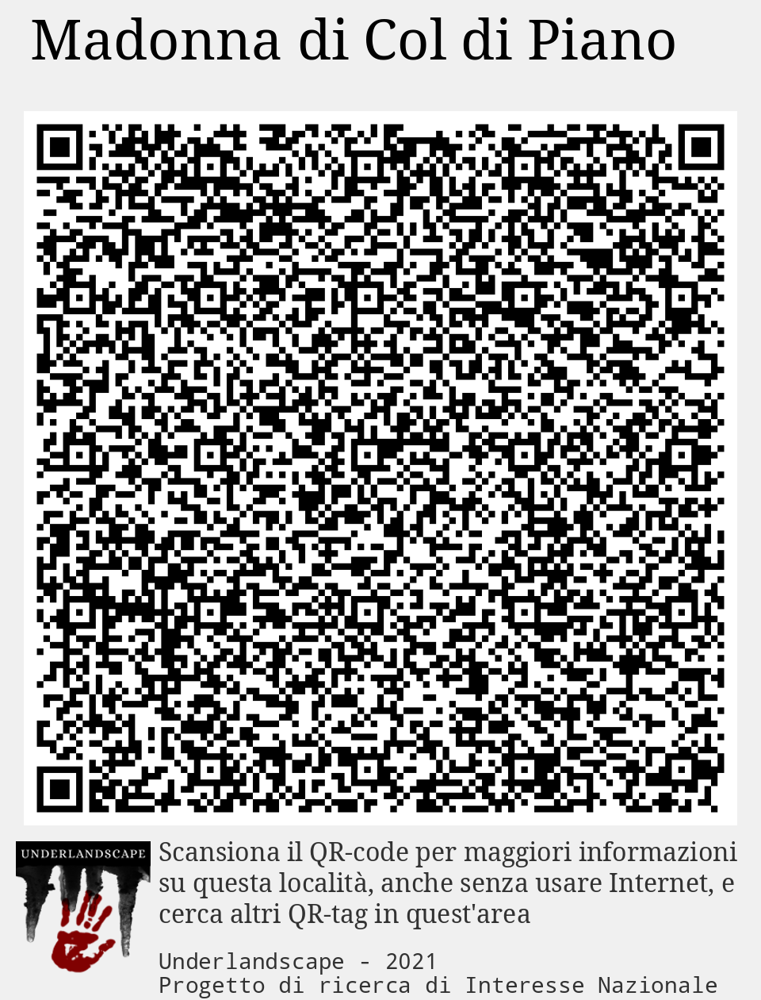

# XQRT000_Casoli
## QRtag: Buca La Piella
 *Nessuna immagine* 

****
## QRtag: Calendario celtico
 *Nessuna immagine* 

****
## QRtag: Castello
 *Nessuna immagine* 

****
## QRtag: Chiesa dei SS. Donato e Andrea
 *Nessuna immagine* 

****
## QRtag: Iscrizione longobarda
 *Nessuna immagine* 

****
## QRtag: Lago di Casoli
 *Nessuna immagine* 

****
## QRtag: Madonna di Castello
 *Nessuna immagine* 

****
## QRtag: Madonna di Col di Piano
 *Nessuna immagine* 

****
## QRtag: Metato
 *Nessuna immagine* 

****
## QRtag: Sant'Andrea de Lacu
 *Nessuna immagine* 

****
## QRtag: Casoli 1
 *Nessuna immagine* 

****
## QRtag: Casoli 2
 *Nessuna immagine* 

****
## QRtag: Casoli 3
 *Nessuna immagine* 

****
## QRtag: Casoli 4
 *Nessuna immagine* 

****
## QRtag: Casoli 5
 *Nessuna immagine* 

****
